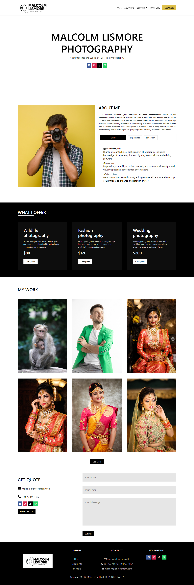

<h2>About the project</h2>

  
To elaborate further on the project, it involves the creation of a professional website for <b>Malcolm Lismore</b>, a freelance photographer based in the North West coast of Scotland. The main goal of the website is to showcase Malcolm’s photography skills, particularly focusing on the natural world, rugged Scottish landscapes, wildlife, and coastal birds. Additionally, the website aims to promote his services for weddings, portraits, and special events.

<h3>Build with:</h3>

» PHP 
» CSS / Bootstrap

<h2>Screenshots of the Project 📸</h2>
 
<h3 align='center'>Home Page 🏡</h3>

